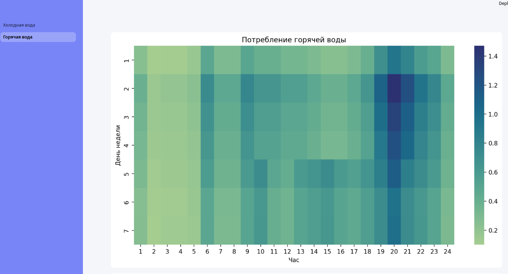

# **Рекомендательный сервис прогнозирования возникновения технологических ситуаций**
Демо-версия  реализована в streamlit   

Для запуска скопируйте репозиторий и запустите в любом просмотрщике (например share.streamlit.io). В качестве основного запускаемого файла выберите **Холодная_вода.py**. 

Демонстрация решения по [ссылке](https://0199a4d4-6997-eb19-f8cf-0e336bfbcf0c.share.connect.posit.cloud/) на posit.cloud.  

Презентация в файле [**Презентация задача 2 DF**](DF задача 2.pdf).

Документация в файле [**Документация задача 2 DF**](Документация задача 2 DF.docx).